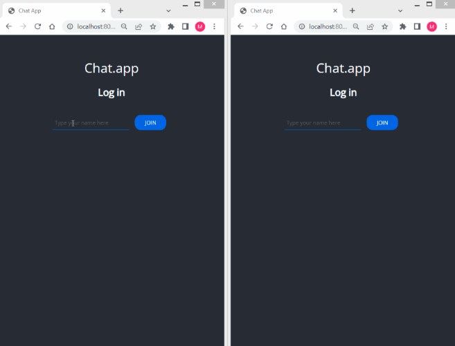

<p align="center">
</a>
</p>
<br>


# Chat app

Real-time chat using WebSocket


## Tech Stack

* CSS
* HTML
* JavaScript
* Socket.io
* Express

  
## Lessons

* design of the application according to UI standards
* real-time communication
* use the Socket.io package in practice 
* use new libraries and develop skills in writing JS
* when to use WebSocket and when AJAX

  
## Installation & run

Instalation
* use yarn to install dependencies

```bash
  yarn install
```

Start the app

```bash
  yarn start
```


## Authors

:woman: [@marcelaos](https://github.com/marcela-os)
